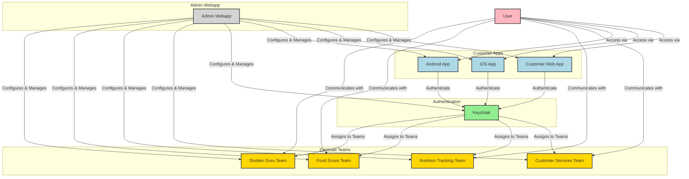
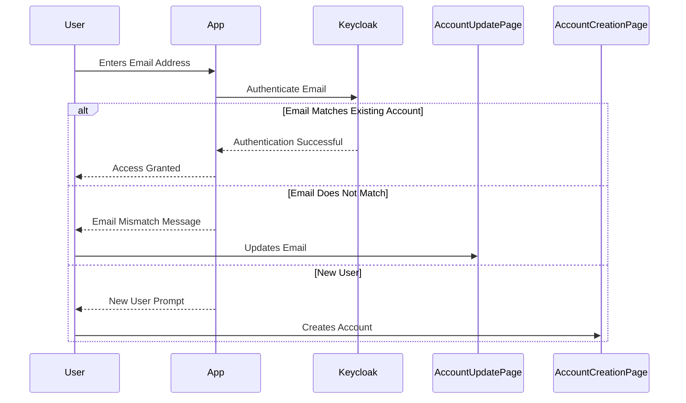
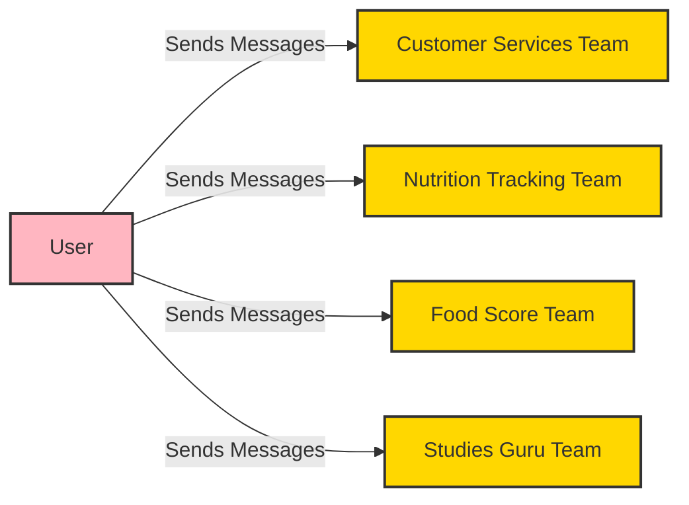
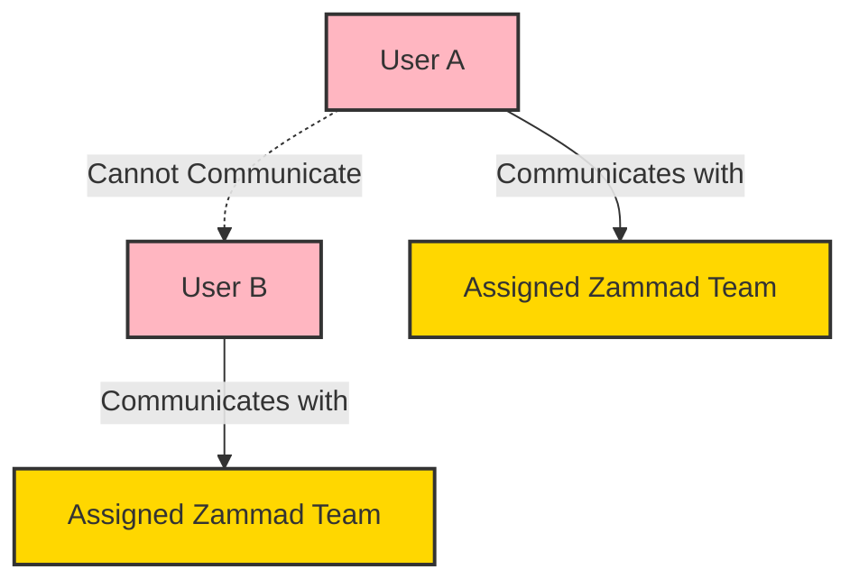
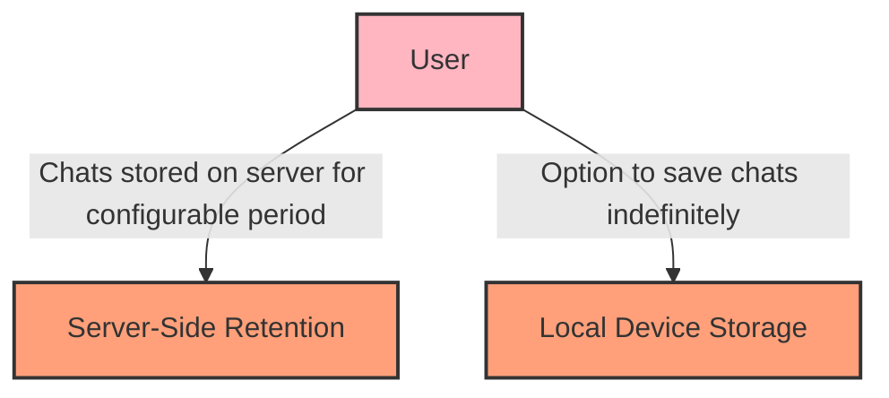

# OpenIM Customization Documentation

## Overview

OpenIM is a multi-platform communication tool that integrates seamlessly with Zammad to handle:

- **Customer service inquiries**
- **Nutrition tracking**
- **Food scoring**
- **Studies-related queries**

The application consists of:

- **Admin Webapp**: Accessible only by staff and developers for administrative tasks.
- **Customer-Facing App**: Available to customers via web, iOS, and Android SDKs.

User authentication and account management are securely managed through Keycloak, ensuring a smooth experience.

This documentation provides detailed information on the application's architecture, user flow, customization options, and key variables.

---

1. [Application Architecture](#application-architecture)
   - [Admin Webapp](#admin-webapp)
   - [Customer Web App & Mobile SDKs](#customer-web-app--mobile-sdks)
2. [Authentication Flow](#authentication-flow)
3. [Account Management](#account-management)
4. [User Interaction with Zammad Teams](#user-interaction-with-zammad-teams)
5. [Permissions and Grouping](#permissions-and-grouping)
6. [Downgrading User Accounts](#downgrading-user-accounts)
7. [Chat Retention and Storage Policies](#chat-retention-and-storage-policies)
8. [Customization Guide](#customization-guide)
   - [Adjusting Chat Retention Period](#adjusting-chat-retention-period)
   - [Managing Zammad Teams](#managing-zammad-teams)
   - [Configuring Permissions](#configuring-permissions)
   - [Updating Authentication Settings](#updating-authentication-settings)
   - [Customizing the User Interface](#customizing-the-user-interface)
9. [Key Variables in the App](#key-variables-in-the-app)
10. [Appendix: Variables and Defaults](#appendix-variables-and-defaults)

---

## Application Architecture

### Admin Webapp

- **Access**: Secured behind a firewall; accessible only to developers and staff.
- **Purpose**: Used for administration, debugging, analysis, and configuring customer-facing apps.

### Customer Web App & Mobile SDKs

- **Access**: Available to customers via:
  - Web browsers
  - iOS SDK
  - Android SDK
- **Purpose**: Enables customer interaction with OpenIM services such as customer support, nutrition tracking, and food scoring.

---

## Authentication Flow

User authentication is managed through **Keycloak** for a unified and secure experience.

### Steps

1. **Initial Login**:
   - Users are prompted to enter their **email address** upon launching the app.

2. **Email Verification**:
   - **Existing Users**:
     - If the email matches an existing account, access is granted.
   - **Email Mismatch**:
     - Users receive the message:
       > *"Your email must match the one associated with your account. If your account email is not up to date, please update it by [clicking here](#)."*
   - **New Users**:
     - If the email is not found, users see:
       > *"If you are not an existing user, you must first create an account by [clicking here](#)."*

---

## Account Management

- Users must ensure their email matches the one associated with their account.
- Account updates are handled through a separate application, accessible via provided hyperlinks.

---

## User Interaction with Zammad Teams

After authentication, users can send messages to various **Zammad teams**, which are automatically linked to their accounts:

- **Customer Services Team**: Handles general inquiries.
- **Nutrition Tracking Team**: Assists with nutrition questions and tracking.
- **Food Score Team**: Helps with food scoring.
- **Studies Guru Team**: Answers questions related to studies and research.

---

## Permissions and Grouping

- **User Isolation**: Users cannot interact with each other; they communicate only with assigned Zammad teams.
- **Permissions**:
  - Users have access only to their individual chats with specific Zammad teams.
  - No group interactions between users are permitted.

---

## Downgrading User Accounts

If a user downgrades their account (e.g., from a paid plan to a free plan):

- **Access to Previous Chats**: They can still view past conversations.
- **Messaging Restrictions**: They cannot send new messages.

---

## Chat Retention and Storage Policies

### Server-Side Retention

- **Default Retention Period**: Chats are stored on the server for **90 days**.
- **Configurable**: This period can be adjusted based on business requirements.

### User Device Storage

- **Local Saving**: Users can opt to save chats on their devices indefinitely.
- **Flexibility**: Allows users to retain important conversations as needed.

---

## Customization Guide

Easily customize key aspects of the OpenIM application to suit your organization's needs.

### Adjusting Chat Retention Period

1. **Access the Admin Webapp**.
2. Navigate to **Settings** > **Chat Retention**.
3. Set the desired retention period in days.
4. **Save** changes.

### Managing Zammad Teams

#### Adding New Teams

1. In the Admin Webapp, go to **Zammad Integration**.
2. Click on **Add Team**.
3. Enter the **team name** and **description**.
4. Assign relevant **permissions**.
5. **Save** the new team.

#### Assigning Users to Teams

- Users are automatically assigned to teams based on their account settings.
- To manually assign a user:
  1. Go to **User Management**.
  2. Select the **user**.
  3. Edit their **assigned teams**.
  4. **Save** changes.

### Configuring Permissions

1. In the Admin Webapp, navigate to **Permissions**.
2. Select the **user** or **group**.
3. Modify **permissions** as needed.
4. **Save** changes.

### Updating Authentication Settings

#### Customizing Messages

1. Access **Authentication Settings** in the Admin Webapp.
2. Edit the **message templates** for email verification and new user prompts.
3. **Save** changes.

#### Updating Account Links

1. Go to **Account Management Settings**.
2. Update the URLs for account update and creation pages.
3. **Save** changes.

### Customizing the User Interface

#### Branding

1. In the Admin Webapp, select **UI Customization**.
2. Upload new **logos** and set **color schemes**.
3. **Preview** changes.
4. **Save** your customizations.

#### Language Support

1. Navigate to **Localization Settings**.
2. Select the **languages** to enable.
3. Provide translations for custom messages if needed.
4. **Save** changes.

---

## Key Variables in the App

- **Groups**:
  - Each user is linked to corresponding Zammad teams, referred to as "groups."
- **Group Permissions**:
  - Users have access only to their chats with assigned Zammad teams.
  - No interaction with other users is allowed.
- **Chat Retention**:
  - **Server-Side**: Default retention is 90 days; configurable.
  - **Local Device**: Users can save chats indefinitely.

---

## Appendix: Variables and Defaults

### Server Retention Time

- **Default**: 90 days
- **Description**: Number of days chats are stored on the server.
- **Customization**: Adjustable to meet business needs.

### Local Storage Option

- **Default**: Enabled
- **Description**: Allows users to save chats on their devices indefinitely.
- **Customization**: Can be enabled or disabled.

### Zammad Teams

- **Default Teams**:
  - Customer Services Team
  - Nutrition Tracking Team
  - Food Score Team
  - Studies Guru Team
- **Customization**: Add, remove, or modify teams as needed.

### User Permissions

- **Default**: Users can only communicate with assigned Zammad teams.
- **Customization**: Permissions can be adjusted per user or group.

### Authentication Messages

- **Default Messages**:
  - Email mismatch notification
  - New user prompt
- **Customization**: Content and links can be personalized.

1. [Application Architecture Diagram](#application-architecture-diagram)
2. [Authentication Flow Diagram](#authentication-flow-diagram)
3. [User Interaction with Zammad Teams Diagram](#user-interaction-with-zammad-teams-diagram)
4. [Permissions Diagram](#permissions-diagram)
5. [Chat Retention Policies Diagram](#chat-retention-policies-diagram)

---

## Application Architecture Diagram

This diagram illustrates the overall architecture of the OpenIM application, including the Admin Webapp, Customer Apps, Authentication via Keycloak, and interaction with Zammad teams.

**Explanation:**

- **User**: Represents the end-user accessing the application.
- **Customer Apps**: The platforms through which users access OpenIM services.
- **Authentication**: Managed by Keycloak for secure user authentication.
- **Zammad Teams**: Teams that handle different user inquiries.
- **Admin Webapp**: Used by staff and developers for configuration and management.

---

## Authentication Flow Diagram

This sequence diagram outlines the authentication process when a user logs into the OpenIM application.

**Explanation:**

- **Email Matches**: User gains access to the app.
- **Email Does Not Match**: User is prompted to update their account email.
- **New User**: User is directed to create a new account.

---

## User Interaction with Zammad Teams Diagram

This diagram shows how authenticated users interact with Zammad teams.

**Explanation:**

- Users can communicate with various Zammad teams based on their needs.

---

## Permissions Diagram

This diagram illustrates the permissions and user isolation within the OpenIM application.

**Explanation:**

- **User Isolation**: Users cannot interact with each other.
- **Communication**: Users can only communicate with their assigned Zammad teams.

---

## Chat Retention Policies Diagram

This diagram presents the chat retention and storage policies of the OpenIM application.

**Explanation:**

- **Server-Side Retention**: Chats are stored for a default of 90 days.
- **Local Storage**: Users can choose to save chats on their devices indefinitely.

---

---

